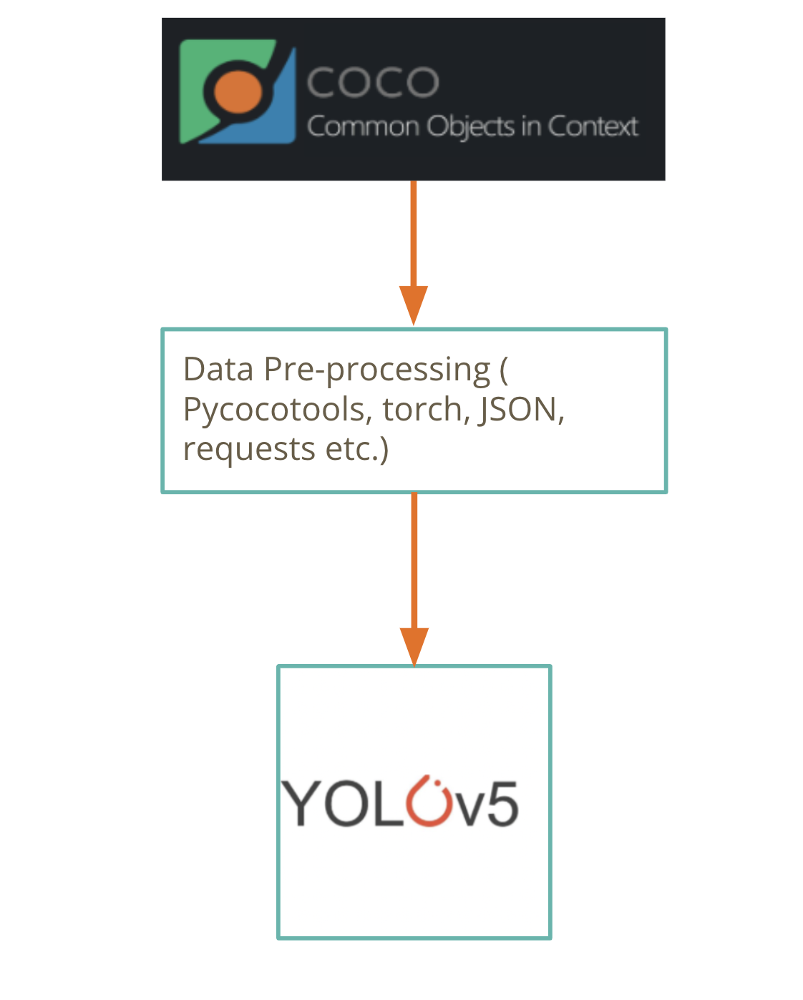

# computer-vision-project

## Project Overview
This project aims to build a computer vision solution for counting and classifying certain objects from a dataset of images.

**Objective:** 
Develop a Python program to count and detect objects from images using computer vision techniques.
The model should be able to recognize and count the following objects (person, car, bicycle) in multiple contexts. 


**Outline:**




## Prerequisites

- Create conda environment with dependencies:
  ```bash
  conda env create -n ENVNAME --file environment.yml
  ```

## Getting Started

- The main workflow for this project can be accomplished in one Google Colab notebook: **SNAI_challenge_YOLO_colab_TVJ.ipynb** 

- It consists of the main sections below:

### Data Preparation

1. Download Data:

- Download the COCO train and validation datasets:
 
*If running locally:*

  ```bash
  python /src/download_data.py
  ```

2. Preprocess Data:

*If running locally (not recommended):*

  - Use the provided functions in **src/data_preprocessing.py** to preprocess the images and organize data directory for downstream tasks.

In Google Colab, to make it easier to run, the custom functions from the "download_data.py" and "data_preprocessing.py" modules are provided in the **SNAI_challenge_YOLO_colab_TVJ.ipynb** notebook. 

### Training the Model

1. Train

- Using YOLOv5 for the object detection task
- Clone their github repository (https://github.com/ultralytics/yolov5)
- Install necessary requirements (might not be needed if working in Google Colab)
- create data configuration file for training
- adjust the model of choice for the correct number of classes (3 in this case)
- Run train.py script in yolov5 repo base directory, leaving an empty string for the weight parameter since we are training a model from scratch as opposed to finetuning a pre-trained model
- visualize metrics to assess model performance


2. Validate the Model

 - evaluate model performance by running val.py script
 - visualize results

### Inference
- Use trained model to run inference on new images that were not part of either the training or validation sets
- Visualize results (with bounding boxes, labels, and count of how many of each object are in each image)

## Resources

- https://towardsdatascience.com/map-mean-average-precision-might-confuse-you-5956f1bfa9e2
- http://cocodataset.org/
- https://github.com/cocodataset/cocoapi/tree/master
- https://github.com/ultralytics/yolov5
- https://docs.ultralytics.com/yolov5/tutorials/train_custom_data/#clearml-logging-and-automation-new
- https://github.com/ultralytics/yolov5/blob/master/tutorial.ipynb
- Jocher, G. (2020). YOLOv5 by Ultralytics (Version 7.0) [Computer software]. https://doi.org/10.5281/zenodo.3908559


